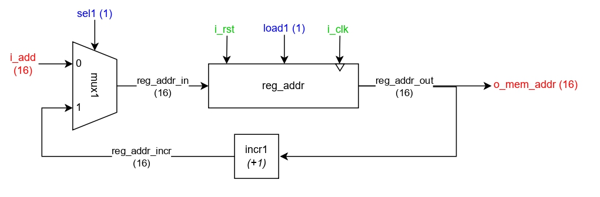
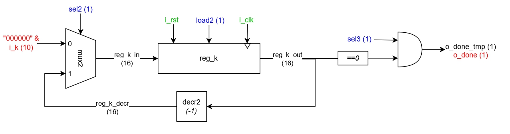
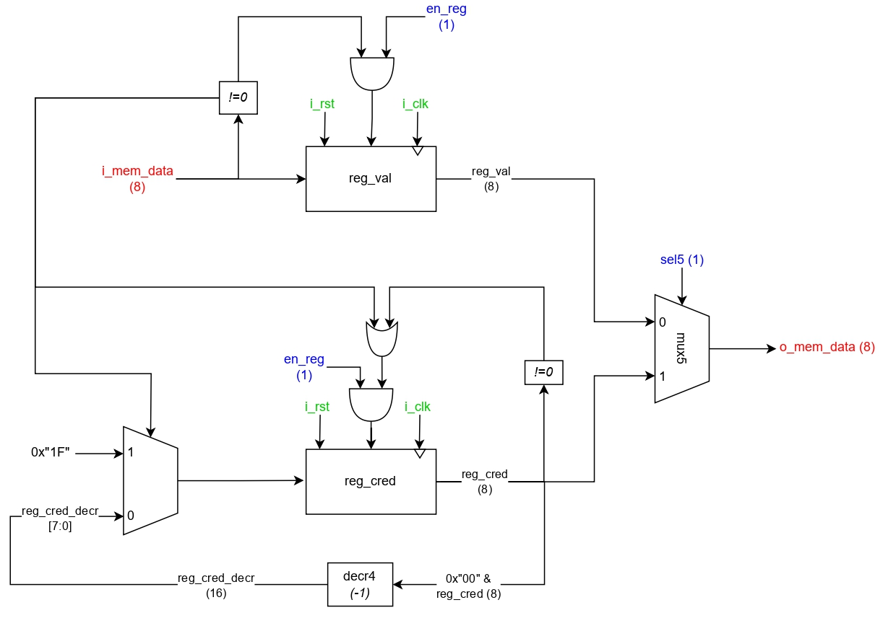
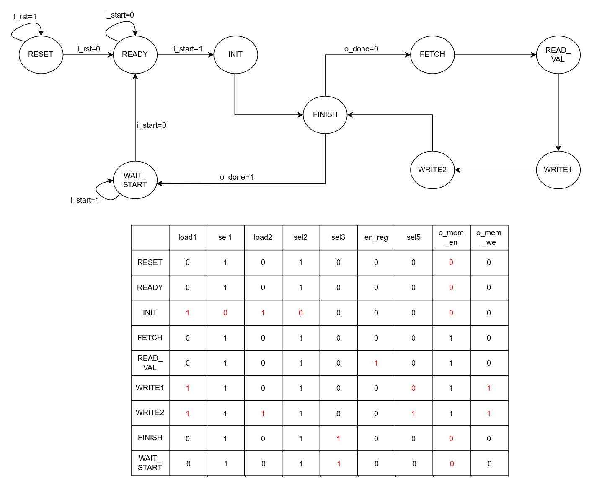

# Digital Circuits Project

This repository contains the VHDL implementation of the Digital Circuits course final project at Politecnico di Milano, aimed at designing a hardware architecture to process memory values according to a specific functional specification.

---

## Project Overview

The project requires designing a hardware system that:

- Reads memory values starting from a given address (`i_add`) for `2*K` words.
- Processes "significant values" (even addresses) and their "credibility" (odd addresses):
  - Non-null significant values have credibility set to 31.
  - Null values inherit the last non-null value, and credibility decrements by 1 per consecutive null read until 0.
  - Initial null values are left as null with credibility 0.
- Interacts with a byte-addressed memory of size `2^16` bytes.
- Ensures all signal propagation delays do not exceed 20 ns (clock period).

**Memory Interface Signals:**

| Signal       | Description |
|-------------|-------------|
| `i_clk`     | Clock signal |
| `i_rst`     | Asynchronous reset |
| `i_start`   | Start operation sequence |
| `i_add`     | Start address (ADD) |
| `i_k`       | Number of significant values (K) |
| `o_done`    | Operation sequence complete |
| `o_mem_addr`| Memory address output |
| `i_mem_data`| Memory data input |
| `o_mem_data`| Memory data output |
| `o_mem_we`  | Memory write enable |
| `o_mem_en`  | Memory enable |

---

## Architecture

The architecture consists of four main parts:

### 1. Memory Address Manager (Module 1)

- 16-bit register to manage memory addresses.
- Controlled by `load1` and `sel1` signals.
- Incremental address generation for reading and writing.

---

### 2. Iteration Counter Manager (Module 2)

- 16-bit register to track remaining iterations (`reg_k`).
- Decrements each iteration.
- Output `o_done` signals end of operation sequence.

---

### 3. Memory Interaction Manager (Module 3)

- Registers `reg_val` and `reg_cred` manage last significant value and credibility.
- Multiplexer selects output to memory.
- Decrements credibility for consecutive null values.

---

### 4. FSM

- Moore machine controlling all signals.
- 9 states: `RESET`, `READY`, `INIT`, `FETCH`, `READ_VAL`, `WRITE1`, `WRITE2`, `FINISH`, `WAIT_START`.
- Handles sequencing, memory control, and iteration logic.

---

## Synthesis & Simulation

- **Target FPGA:** Artix-7 xc7a200tfbg484-1
- **Flip-flops used:** 52
- **Timing:** Positive slack of 16.213 ns, within the 20 ns clock period.
- **Simulation:** Post-synthesis functional simulation confirms correct operation.

---

## Notes

- The VHDL code is a mix of **structural** and **behavioral** styles to explore different implementation techniques.
- The architecture follows the functional specification and handles all corner cases for memory management and credibility calculation.
- The FSM is implemented as a Moore machine with outputs depending only on the current state.
